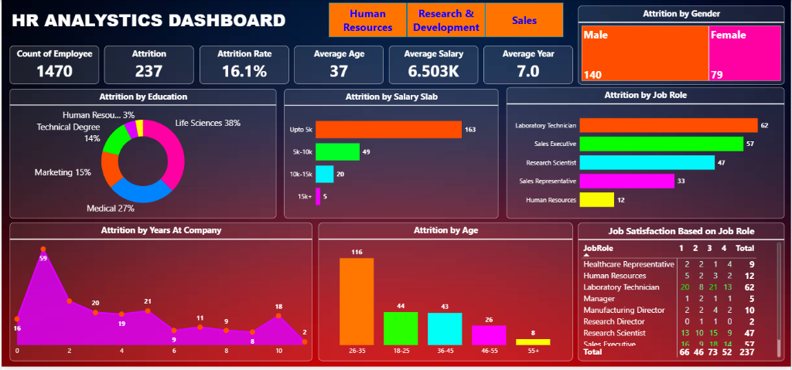

# 📊 HR Analytics Dashboard

An interactive **Power BI** dashboard that provides comprehensive insights into employee attrition, demographics, and job satisfaction across an organization. This tool empowers HR teams and leadership to make data-driven decisions for improving employee retention and workplace satisfaction.

---



---

## 🔑 Key Metrics

| Metric             | Value    |
|---------------------|----------|
| **Total Employees** | 1,470    |
| **Attrition Count** | 237      |
| **Attrition Rate**  | 16.1%    |
| **Average Age**     | 37       |
| **Average Salary**  | ₹6.503K  |
| **Average Tenure**  | 7.0 Years|

---

## 📈 Dashboard Features

### 🏢 Department Filters
Filter all visuals by department:
- **Human Resources**
- **Research & Development**
- **Sales**

### 📉 Attrition Analysis

- **Attrition by Education** — Donut chart breaking down attrition across education fields:
  - Life Sciences (38%)
  - Medical (27%)
  - Marketing (15%)
  - Technical Degree (14%)
  - Human Resources (3%)

- **Attrition by Salary Slab** — Horizontal bar chart showing attrition distribution by salary range:
  - Up to 5K: 163 employees
  - 5K–10K: 49 employees
  - 10K–15K: 20 employees
  - 15K+: 5 employees

- **Attrition by Job Role** — Horizontal bar chart highlighting the most impacted roles:
  - Laboratory Technician: 62
  - Sales Executive: 57
  - Research Scientist: 47
  - Sales Representative: 33
  - Human Resources: 12

- **Attrition by Gender** — Card visuals showing gender-wise attrition:
  - Male: 140
  - Female: 79 (out of 237 total)

- **Attrition by Years at Company** — Area/line chart showing attrition trends based on employee tenure (0–10+ years)

- **Attrition by Age** — Bar chart segmenting attrition by age groups:
  - 26–35: 116
  - 18–25: 44
  - 36–45: 43
  - 46–55: 26
  - 55+: 8

### 😊 Job Satisfaction Matrix
A cross-tabulation of **Job Role × Satisfaction Rating (1–4)**, providing granular insight into satisfaction levels by role, including:
- Healthcare Representative
- Human Resources
- Laboratory Technician
- Manager
- Manufacturing Director
- Research Director
- Research Scientist
- Sales Executive

---

## 🛠️ Tools & Technologies

| Tool        | Purpose                          |
|-------------|----------------------------------|
| **Power BI** | Data visualization & dashboarding |
| **DAX**      | Calculated measures & KPIs       |
| **Excel/CSV**| Data source                      |

---

## 🚀 Getting Started

### Prerequisites
- [Microsoft Power BI Desktop](https://powerbi.microsoft.com/desktop/) (free)

### Usage
1. Clone or download this repository:
   ```bash
   git clone https://github.com/<your-username>/HR-Analytics-Dashboard.git
   ```
2. Open `HR Analytics Dashboard.pbix` in **Power BI Desktop**.
3. Explore the interactive visuals — use the **department filter buttons** at the top to drill down into specific departments.

---

## 📂 Project Structure

```
HR-Analytics-Dashboard/
├── HR Analytics Dashboard.pbix   # Power BI dashboard file
└── README.md                     # Project documentation
```

---

## 💡 Key Insights

- **Highest attrition** occurs in employees earning **up to ₹5K**, suggesting compensation may be a retention factor.
- The **26–35 age group** has the most attrition (116), indicating early-to-mid career employees are most likely to leave.
- **Laboratory Technicians** and **Sales Executives** are the top two roles with the highest attrition.
- **Life Sciences** education background accounts for the largest share of attrition at **38%**.
- Attrition peaks at **year 1** of tenure, indicating potential onboarding or early engagement issues.

---

## 📄 License

This project is open source and available under the [MIT License](LICENSE).

---

## 🤝 Contributing

Contributions, issues, and feature requests are welcome! Feel free to open an issue or submit a pull request.

---

> **Built with ❤️ using Power BI**
